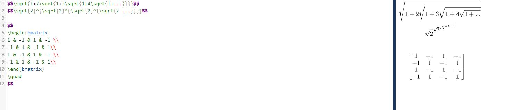
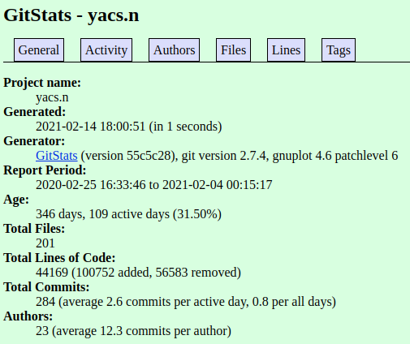
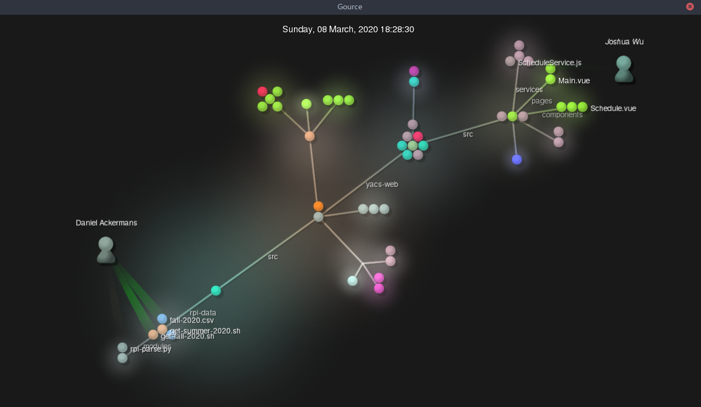
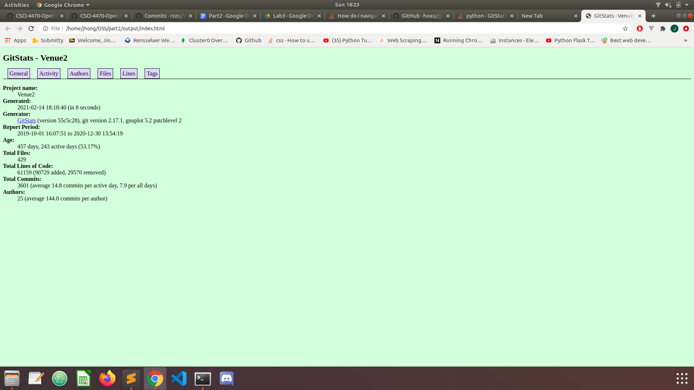
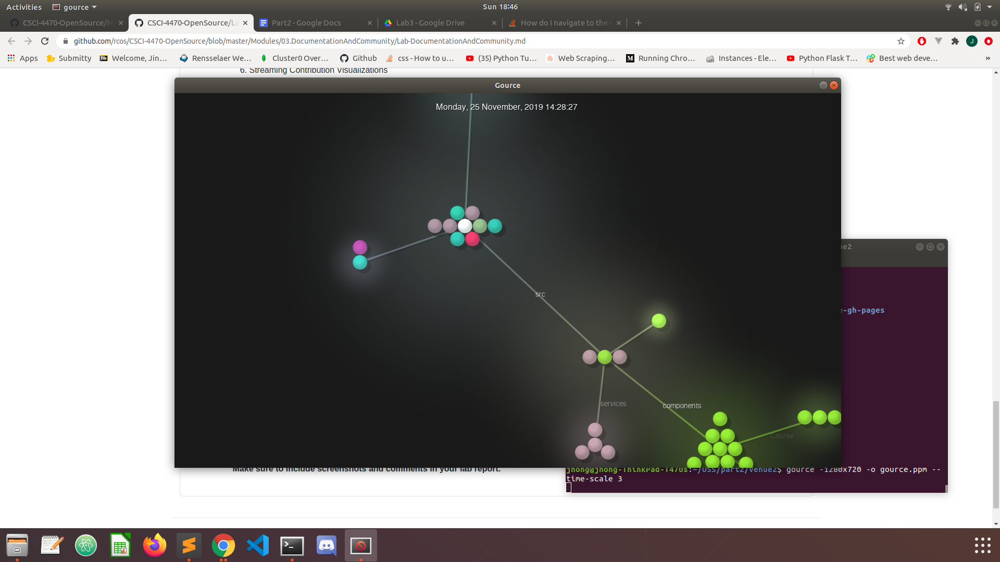
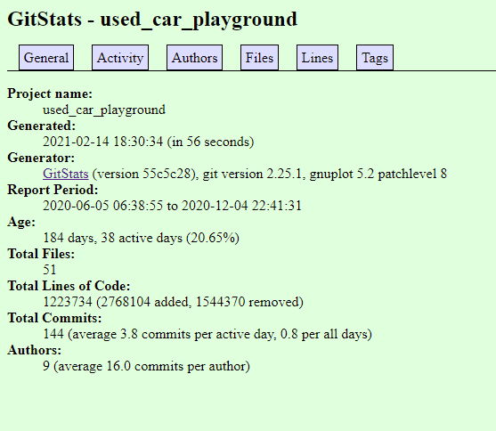

# Lab3
## Part 1 

## Part 2 
<pre>
TutorBase stats
12 contributors 
31562 lines of code 
newest commit by jweiss0 to merge branch "tutor-operations" (dec 10,2020) 
first commit by "DangItJason" on jun 5th 2020 
current branches are 
master, client-meetings,data-analysis,jacob.zamani/redux_refactor/navigation,jacob.zamani/scheduler
nicholas.arnold/new_scheduler,nicholas.arnold/redux_refactor,schedule-meeting,
thomas.arturi/login-redesign,thomas.arturi/react_schedule_selector,
tutor_settings_redux

Gitstats:
Project name
	TutorBase
Generated
	2021-02-15 13:28:15 (in 7 seconds)
Generator
	GitStats (version ad6df85), git version 2.25.1, gnuplot 5.2 patchlevel 8
Report Period
	2020-06-05 14:43:57 to 2020-12-10 12:19:39
Age
	189 days, 73 active days (38.62%)
Total Files
	133
Total Lines of Code
	24158 (88106 added, 63948 removed)
Total Commits
	183 (average 2.5 commits per active day, 1.0 per all days)
Authors
	13 (average 14.1 commits per author)
</pre>
Gitstats seems to be much more thorough and I was definitely a little off in my analysis.
I'm honestly suprised by how off my code count was, I used the command "git ls-files -z | xargs -0 wc -l"
for my code and its suprising to see how far off it is.   

### YACS

#### Manual Stats

- Number of Contributors: 18
- Number of Lines: 44600
- First Commit: "initial commit" by jshom, committed on Feb 25, 2020
- Last Commit: "Update spring 2021 csv" by marchdan, committed on Feb 3, 2021
- Branches:
    - 52-scheduling
	- 280-loadPageSpinner
	- 338-mobile-ui-revised
	- add_vuex
	- admin_panel_ui
	- coursePage-recommendation
	- create-pull-request/patch
	- csv-fix
	- dark-mode
	- fixTimeSpring2021CSV
	- page_for_department
	- s21
	- seo
	- showDatabaseError
	- shruti_yacs
	- spring_2021_update
	- subject_fail_reload
	- summer2020-demo
	- windows_support
	- #230
	- #259

#### Gitstats

It appears that there are slightly less lines of code on Gitstats but slightly
more contributors.

#### Gource

### Venue

#### Manual Stats

- Number of Contributors: 16
- Number of Lines: 562692
- First Commit: "initial commit" by tdurkin18, committed on Oct 1, 2019
- Last Commit: "redact numfor’s password" by TheStopsign, committed on Dec 30, 2020
- Number of Branches: 54

#### Gitstats

The lines of code and the number of contributors are different. Gitstats states
that there are 61159 lines while Github states that there are 562,692 lines.
Gitstats also states that there are 25 contributors while Github states that
there are 16 contributors.

#### Gource

### Used Car Playground

#### Manual Stats

- Number of Contributors: 6
- Number of Lines: 1251051
- First Commit: "Update map.r", committed on Nov 13, 2020
- Last Commit: "11/15 update", committed on Dec 4, 2020
- Branches:
    - master
    - LOGO&backGround
    - selenium
    - song_xu_patch_1
    - bokehapp
    - data_analysis_on_maps

#### Gitstats

It seems as if the number of lines between whats shown on the website and whats on github are different.

#### Gource

